# Antigravity Voice Assistant 🎙️⚡

[](https://opensource.org/licenses/MIT)
[](https://microsoft.com/windows)
[](#)
[](#)
[](#)

> **The fastest, zero-latency, 100% offline Text-to-Speech (TTS) voice assistant extension for Google Antigravity IDE and VS Code.**
> Reads AI chat responses aloud automatically with natural Markdown speech normalization, strict multi-chat FIFO queuing, and live interactive controls.

---

## 🌟 Why Antigravity Voice Assistant?

When using AI coding assistants like **Google Antigravity IDE**, **GitHub Copilot**, or **Cursor**, reading massive walls of generated code and architectural plans strains your eyes. 

Cloud-based Text-to-Speech solutions (Google TTS, OpenAI Audio, ElevenLabs) suffer from:
- ❌ **10–20 second network delays** waiting for audio chunks to synthesize over HTTPS.
- ❌ **Expensive API credit bills** and rate limits.
- ❌ **Privacy exposure**, sending your proprietary code and queries to third-party cloud audio servers.
- ❌ **Reciting ugly syntax**, spelling out markdown headers (`###`), bracketed URLs, emojis, and 50 lines of code syntax aloud.

**Antigravity Voice Assistant solves all of this locally:**
- ⚡ **Sub-100ms Instant Playback:** Powered directly by native Windows Speech Synthesis (`System.Speech.Synthesis`), starting playback almost instantaneously.
- 🔒 **100% Private & Offline:** Zero external network requests. Zero API keys. Zero cloud costs.
- 🤖 **Universal Auto-Play Watcher:** Automatically detects completed responses across all open chat tabs in real time without requiring LLMs to remember tool calls.
- 🚦 **FIFO Sequential Multi-Chat Queue:** If Chat 1 is speaking and Chat 2 finishes, Chat 2 waits patiently in line. Never cuts off in between!
- 🧹 **Intelligent Markdown Normalizer:** Automatically strips raw hashes (`###`), URLs, brackets, long code blocks, and emojis into clean, fluent, human-like speech.
- 🎛️ **Full IDE UI Controls:** Interactive status bar items and dedicated sidebar panel with live Toggle ON/OFF, Stop, Replay, History, Voice selection, and Speed adjustments.

---

## 🚀 Key Features

### 1. Smart Markdown Speech Normalization (`cleanTextForSpeech`)
Raw LLM markdown is unlistenable when read literally. Our engine cleans text in memory before speech:
- **Markdown Headers:** `### Architecture Summary` ➡️ *"Architecture Summary."*
- **File Links:** `[Service.cs](file:///...)` ➡️ *"Service dot cs"*
- **Code Blocks:** Replaces multi-line code blocks with *"as shown in the code snippet."*
- **Short Commands:** `Ctrl + Shift + P` ➡️ *"Control Shift P"*
- **Noise Elimination:** Strips decorative emojis, markdown table vertical bars, horizontal rules, and raw URLs.

### 2. Universal Background Chat Watcher
You do not need to prompt the AI model to *"call the speech tool"*. The extension actively monitors internal IDE transcript events across all active chats and speaks completed answers aloud automatically.

### 3. Strict Sequential FIFO Audio Queue
Work across multiple AI chats simultaneously without chaos:
$$\text{Chat 1 Playing} \xrightarrow{\text{Chat 2 Completes}} \text{Enqueued in FIFO Queue} \xrightarrow{\text{Chat 1 Finishes}} \text{Chat 2 Plays Next}$$
Never cut off mid-sentence.

### 4. Zero Screen Reading or Scraping
This extension **never** captures your screen, uses OCR, or inspects display pixels. It streams plain text directly from the IDE's local event log to the operating system soundcard.

---

## 🎛️ Status Bar & Sidebar Controls

### Status Bar Buttons:
- 🔊 **`Voice: ON / OFF`**: Global master switch. When toggled OFF, speech and conversion are completely bypassed.
- ▶️ **`Replay` / ⏹️ `Stop Voice`**: Dynamically switches to red **Stop Voice** while audio is playing. Clicking cancels playback instantly. When idle, clicking **Replay** repeats the last response.
- ⏮️ **`Prev`** / ⏭️ **`Next`**: Step backward and forward through your response history.
- ⚙️ **`Settings`**: Quick-switch default voice (**Zira**, **David**, **Hazel**) and speaking speed (-5 to +5).

---

## 📦 Installation

### Method 1: Direct Extension Copy (Recommended)
1. Clone this repository into your extensions directory:
   ```bash
   git clone https://github.com/mdadilrasheed20/antigravity-voice-assistant.git "%USERPROFILE%\.antigravity-ide\extensions\fast-tts-controller"
   ```
   *(For standard VS Code, clone into `%USERPROFILE%\.vscode\extensions\fast-tts-controller`)*

2. Open Antigravity IDE / VS Code, press **`Ctrl + Shift + P`**, and select:
   ```
   Developer: Reload Window
   ```

3. The Voice controls will appear in your bottom-right status bar and the Voice Assistant icon will appear in your primary Activity Bar!

---

## 🛠️ Architecture Overview

```mermaid
flowchart LR
    A[AI Model Response] -->|Appends to transcript.jsonl| B[Antigravity IDE Core]
    B -->|Fast File Watcher| C[fast-tts-controller Extension]
    C -->|cleanTextForSpeech| D[Markdown Normalizer]
    D -->|enqueueSpeech| E[FIFO Sequential Audio Queue]
    E -->|System.Speech.Synthesis| F[Windows Audio Subsystem]
    F -->|Local Speakers / Headphones| G[Developer Hears Speech]
```



---

## 📋 Requirements
- **Operating System:** Windows 10 or Windows 11 (64-bit)
- **IDE:** Google Antigravity IDE or VS Code 1.74+
- **Runtimes:** PowerShell (built into Windows), Node.js

---

## 📄 License
Released under the [MIT License](LICENSE). Built for developers, pair-programmers, and accessibility champions.
